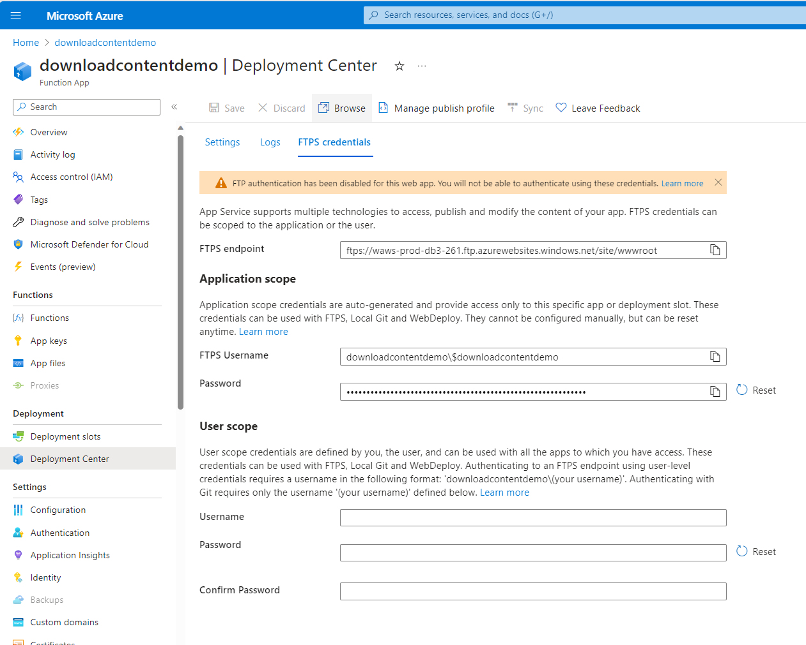
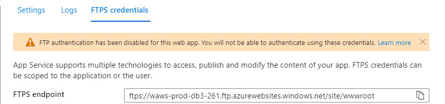
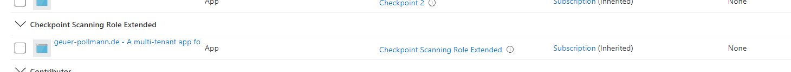
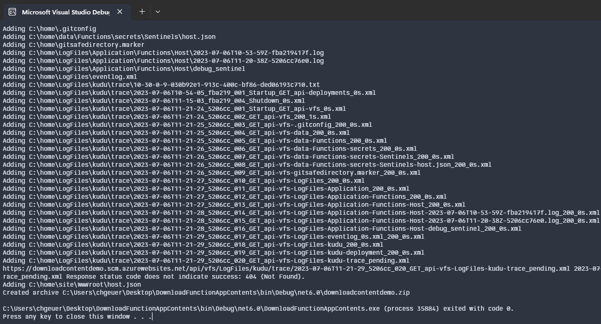

# Download file system contents of a web app or function on Azure App Services

>  This proof-of-concept leverages the 'virtual file system' API (the `/api/vfs` endpoint) from Kudu to recursively download the contents of an Azure Web App or Function app.

## Application Scope credentials

Your web app or function app's underlying site has 'application scope' credentials, which can be viewed in the portal under "Deployment Center -> FTPS credentials -> Application scope":



To be authorized to fetch the password, the caller must have the `"Microsoft.Web/sites/config/list/Action"` permission. 

The credential can also programmatically be fetched from the [ARM REST API](https://learn.microsoft.com/en-us/rest/api/appservice/web-apps/list-publishing-credentials) by POSTing to one of these two endpoints (depending on whether you're using a slot), of course filling in the `...` placeholders appropriately:

- `/subscriptions/.../resourceGroups/.../providers/Microsoft.Web/sites/.../config/publishingcredentials/list?api-version=2022-09-01`
- `/subscriptions/.../resourceGroups/.../providers/Microsoft.Web/sites/.../slots/.../config/publishingcredentials/list?api-version=2022-09-01`

This application-scoped credential represents a username/password combination, which is somewhat unrelated to Azure Resource Manager's identity system, and many organizations want to avoid having passwords like this one being used for production purposes. In particular, this warning shows that the password isn't usable for FTPS or calling Kudu APIs:



Azure ARM allows to individually allow/disallow the use of that password credential for `ftp` and the `scm` (Kudu) APIs. 

By calling the `az` CLI, you can selectively enable (allow) or disallow the use of the password (for `ftp` and/or `scm`):

```azcli
az resource update \
   --subscription "${subscriptionId}" \
   --resource-group "${resourceGroupName}" \
   --namespace Microsoft.Web \
   --parent "sites/${siteName}" \
   --resource-type basicPublishingCredentialsPolicies \
   --name scm \
   --set properties.allow=true
```

You can programmatically read/write these settings by calling the ARM REST API via the endpoint `/subscriptions/.../resourceGroups/.../providers/Microsoft.Web/sites/.../basicPublishingCredentialsPolicies/scm?api-version=2022-09-01`. 

Reading or writing to that endpoint requires the ARM permissions

- `Microsoft.Web/sites/basicPublishingCredentialsPolicies/read` 
- `Microsoft.Web/sites/basicPublishingCredentialsPolicies/write` 

## Downloading contents

One hacky way to download the contents of an app service would be this:

1. Determine whether the basic publishing credentials can be used on the SCM endpoint (by fetching `.../basicPublishingCredentialsPolicies/scm`).
2. If the setting is `{"allow": false}`, flip it to `true` temporarily, i.e. remember to turn it off again!
3. Fetch the application-scope username/password by POSTing to `.../config/publishingcredentials/list`
4. Use that credential to recursively traverse the virtual file system endpoint `https://XXX.scm.azurewebsites.net/api/vfs/`. During the traversal, you encounter a few types of notes, depending on their `MIME` property:
   - The `"inode/directory"` nodes are subdirectories to traverse into.
   - The  `"inode/shortcut"` nodes are symbolic links, leading you to the operating system files and other potentially irrelevant parts, so you might skip thesi:
   - All other MIME types you certainly want to download.
5. Once the traversal is finished, if you previously enabled the `basicPublishingCredentialsPolicies/scm` allow-setting, remember to turn it off again.

## Across tenants

This approach works across AAD tenants. In this sample, you can see a custom AAD role:

```json
{
  "Name": "ISV Web Site Scanning Role",
  "Description": "Allows download of Web App credentials and enabling and disabling basic auth for the SCM site.",
  "AssignableScopes": [ "/subscriptions/${subscriptionId}" ],
  "Actions": [ 
     "Microsoft.Web/sites/config/list/Action",
     "Microsoft.Web/sites/basicPublishingCredentialsPolicies/scm/Read",
     "Microsoft.Web/sites/basicPublishingCredentialsPolicies/scm/Write",
     "Microsoft.Web/sites/slots/basicPublishingCredentialsPolicies/scm/Write",
     "Microsoft.Web/sites/slots/basicPublishingCredentialsPolicies/scm/Read"
  ]
}
```

Installing this role in a customer tenant, and authorizing the ISV's multi-tenant app to have that permission at subscription or management group level, allows traversing / accessing function apps and web apps in other AAD tenants.

In this screenshot, you can see the app service's "Access Control (IAM)" role assignments, and that the multi-tenant app from the ISV tenant has permissions from subscription scope trickling into the app service:



## Demo time

The included C# demo uses a service principal credential of a multi-tenant app to traverse 

Running the C# utility against a new function app in a different tenant gives this:




