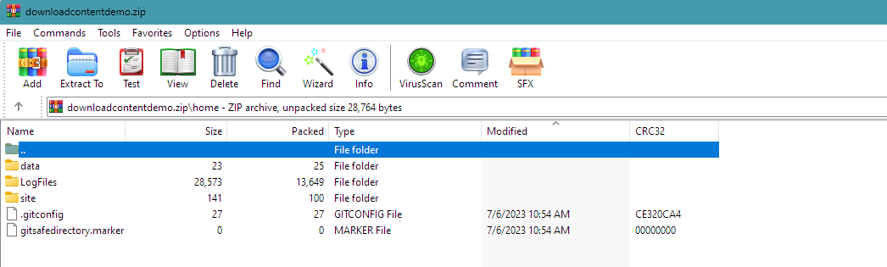

# Download file system contents of a web app or function on Azure App Services

To download contents from a function app or app services plan, there are various APIs with associated authentication/authorization requirements.

## APIs

### FTPS (`ftps://`)

**Endpoint:** The web hosting plan might have an FTPS endpoint (FTP with TLS encryption). The FTPS service is not running on the SCM/Kudu endpoint, but on the web hosting plan's underlying compute stamp, with a hostname like `waws-prod-dbx-xxx.ftp.azurewebsites.windows.net`. 

**Credential:** This endpoint *might* be accessible using the 'application scope' credential. We ignore the 'user scope' credential, because this is not usable for service principals, as it's tied to a human user. The 'application scope' credential is a username/password combination, whereas the username is consists of the web app's / function app's site name (`mydemosite\$mydemosite`), and the password is server-generated, i.e. it can only be read (by callers who have the `"Microsoft.Web/sites/config/list/Action"` permission). 

Enterprises might disable these credentials (to avoid the proliferation of username/passwords). Whether usage of the credential is allowed or not can be checked by querying the `/subscriptions/.../resourceGroups/.../providers/Microsoft.Web/sites/.../basicPublishingCredentialsPolicies/ftp?api-version=2022-09-01` ARM API (assuming the caller has the `Microsoft.Web/sites/basicPublishingCredentialsPolicies/read` permission). The same API allows to enable/disable the credential (for callers who have the `Microsoft.Web/sites/basicPublishingCredentialsPolicies/write`  permission).


### Traversing the virtual file system (`/api/vfs`) Kudu REST API

The SCM/Kudu site might expose a virtual file system (VFS) REST API:


This REST API is available on the URL`https://mydemosite.scm.azurewebsites.net/api/vfs/` (the `mydemosite` must of course point to your site), and can be called using 2 authentication methods:

- Application Scope Credential
- Azure AD Authentication / Bearer token

### Downloading a ZIP via the `/api/zip/.../` Kudu REST API

As described in the [kudu docs](https://github.com/projectkudu/kudu/wiki/REST-API#zip), the "Zip" REST API allows downloading folders as zip files:

```csharp
ClientSecretCredential cred = new(tenantId: ..., clientId: ..., clientSecret: ...);
AccessToken accessToken = await cred.GetTokenAsync(new(scopes: new[] { "https://management.azure.com/.default" }));

var sitename = "...";
string folderToDownload = "";

var httpClient = accessToken.CreateSCMBearerHttpClient();
using var zipStream = await httpClient.GetStreamAsync($"https://{sitename}.scm.azurewebsites.net/api/zip/{folderToDownload}");
using var fileStream = File.OpenWrite("1.zip");
await zipStream.CopyToAsync(fileStream);
```

### Downloading a ZIP for a function via the `/api/functions/admin/download` Kudu REST API

The `FunctionController` also allows to download a ZIP file for an Azure function. It supports the query parameters `includeCsproj=true` and `includeAppSettings=true` to include Visual Studio-specific files. 

## Credentials

### Application Scope credentials

Your web app or function app's underlying site has 'application scope' credentials, which can be viewed in the portal under "Deployment Center -> FTPS credentials -> Application scope":


To be authorized to fetch the password, the caller must have the `"Microsoft.Web/sites/config/list/Action"` permission. 

The credential can also programmatically be fetched from the [ARM REST API](https://learn.microsoft.com/en-us/rest/api/appservice/web-apps/list-publishing-credentials) by POSTing to one of these two endpoints (depending on whether you're using a slot), of course filling in the `...` placeholders appropriately:

- `/subscriptions/.../resourceGroups/.../providers/Microsoft.Web/sites/.../config/publishingcredentials/list?api-version=2022-09-01`
- `/subscriptions/.../resourceGroups/.../providers/Microsoft.Web/sites/.../slots/.../config/publishingcredentials/list?api-version=2022-09-01`

This application-scoped credential represents a username/password combination, which is somewhat unrelated to Azure Resource Manager's identity system, and many organizations want to avoid having passwords like this one being used for production purposes. In particular, this warning shows that the password isn't usable for FTPS or calling Kudu APIs:


Azure ARM allows to individually allow/disallow the use of that password credential for `ftp` and the `scm` (Kudu) APIs. 

By calling the `az` CLI, you can selectively enable (allow) or disallow the use of the password (for `ftp` and/or `scm`):

```azcli
az resource update \
   --subscription "${subscriptionId}" \
   --resource-group "${resourceGroupName}" \
   --namespace Microsoft.Web \
   --parent "sites/${siteName}" \
   --resource-type basicPublishingCredentialsPolicies \
   --name scm \
   --set properties.allow=true
```

You can programmatically read/write these settings by calling the ARM REST API via the endpoint `/subscriptions/.../resourceGroups/.../providers/Microsoft.Web/sites/.../basicPublishingCredentialsPolicies/scm?api-version=2022-09-01`. 

Reading or writing to that endpoint requires the ARM permissions

- `Microsoft.Web/sites/basicPublishingCredentialsPolicies/read` 
- `Microsoft.Web/sites/basicPublishingCredentialsPolicies/write` 

#### Limited Permissions

With a comparably small set of permissions, one can retrieve the application scope credential (`config/list/Action`), and if needed temporarily enable (`basicPublishingCredentialsPolicies/scm/Write`) that credential:

```json
{
  "Name": "ISV Web Site Scanning Role",
  "Description": "Allows download of Web App credentials and enabling and disabling basic auth for the SCM site.",
  "AssignableScopes": [ "/subscriptions/${subscriptionId}" ],
  "Actions": [ 
     "Microsoft.Web/sites/config/list/Action",
     "Microsoft.Web/sites/basicPublishingCredentialsPolicies/scm/Read",
     "Microsoft.Web/sites/basicPublishingCredentialsPolicies/scm/Write",
     "Microsoft.Web/sites/slots/basicPublishingCredentialsPolicies/scm/Write",
     "Microsoft.Web/sites/slots/basicPublishingCredentialsPolicies/scm/Read"
  ]
}
```

Installing this role, and authorizing the service principal to have that permission at subscription or management group level, allows traversing / accessing function apps and web apps. In this screenshot, you can see the app service's "Access Control (IAM)" role assignments, and that the multi-tenant app from the ISV tenant has permissions from subscription scope trickling into the app service:


### Azure Active Directory authentication / Bearer credential

The APIs on the Kudu/SCM endpoint accept AAD-issued JWT credentials, communicated in the `Authorization: Bearer ...` HTTP header. The token must have an audience pointing to the Azure Management API, and the **principal must have `Contributor` permissions on the web app**.

In comparison to the the app scope credential for basic auth, the AAD approach with Contributor permissions is pretty serious, as it gives the service principal `"Actions": [ "*" ]` on the web app or even broader.

## Cross-tenant access for SaaS solutions

The approaches here work across AAD-tenant boundaries. If an ISV creates a multi-tenant app, and a customer installs the app in the customer's AAD tenant, the customer can grant the ISV either `Contributor` permissions (for AAD-based Kudu/SCM access), or the customer creates a custom role with limited permissions to fetch/enable/disable the application-scope credentials.

## Downloading contents

One hacky way to download the contents of an app service would be this:

1. Determine whether the basic publishing credentials can be used on the SCM endpoint (by fetching `.../basicPublishingCredentialsPolicies/scm`).
2. If the setting is `{"allow": false}`, flip it to `true` temporarily, i.e. remember to turn it off again!
3. Fetch the application-scope username/password by POSTing to `.../config/publishingcredentials/list`
4. Use that credential to recursively traverse the virtual file system endpoint `https://XXX.scm.azurewebsites.net/api/vfs/`. During the traversal, you encounter a few types of notes, depending on their `MIME` property:
   - The `"inode/directory"` nodes are subdirectories to traverse into.
   - The  `"inode/shortcut"` nodes are symbolic links, leading you to the operating system files and other potentially irrelevant parts, so you might skip thesi:
   - All other MIME types you certainly want to download.
5. Once the traversal is finished, if you previously enabled the `basicPublishingCredentialsPolicies/scm` allow-setting, remember to turn it off again.


## Demo time

The included C# demo uses a service principal credential of a multi-tenant app to traverse 

Running the C# utility against a new function app in a different tenant gives this:



